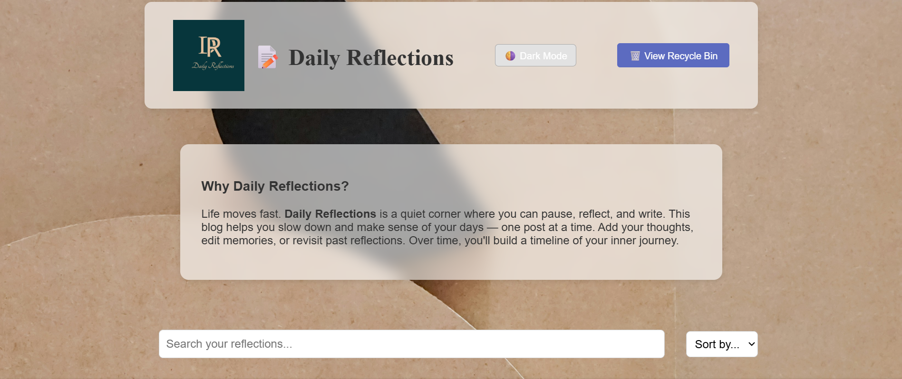

# 📝 Daily Reflections – Code Challenge 3

Hey there! I'm the developer behind **Daily Reflections**, a calm and simple journaling app I built for **Code Challenge 3** at Moringa School. This project helped me dive deeper into DOM manipulation, API interactions, and building a user-friendly interface — all without using any frameworks.

**Daily Reflections** is more than a blog — it’s a peaceful space for you (or future users) to pause, write, and revisit your thoughts. Whether you're jotting down a happy moment or processing a tough one, this app helps you track your inner journey.

---

## 🚀 Features

Here's what I built from scratch (and had a blast doing):

- 📝 **Add New Reflections** — Title, content, and author fields
  
- 👀 **View Details** — Click a post to see it in full

- ✏️ **Edit Posts** — Update your writing anytime

- 🗑️ **Soft Delete** — Accidentally deleted? No problem! Posts go to the Recycle Bin first

- ♻️ **Restore Posts** — Bring a deleted post back to life

- ❌ **Permanently Delete** — For when you're sure it's time to let go

- 🌗 **Dark Mode** — Because vibes matter

- 🔍 **Live Search** — Find reflections by keyword

- 🔡 **Sort Posts** — Alphabetical sorting by title or author

- ✅ **Popup Notifications** — For friendly feedback after every action

---
## 💡 Why I Built This
In a fast-paced world, I wanted to create something quiet and useful — a digital space to reflect. **Daily Reflections** is a tool for journaling, but also a technical challenge to:

- Practice state management without a framework
  
- Handle CRUD interactions with a fake backend
  
- Design a UI that feels intentional and focused
  
- Implement soft deletes (a recycle bin) — just like real apps!

This project was coded from scratch by me. I deliberately avoided libraries like React to get deeper practice with DOM manipulation and fetch-based state syncing.

---

 ## Smart UX Features
- Live **search bar** filters posts by title, content, or author
  
- **Sort dropdown** sorts by title or author alphabetically
  
- **Dark Mode toggle** switches between light and dark themes
  
- **Recycle Bin View:** Toggle to see only deleted posts and restore or remove them
  
- **Notification system** provides visual feedback after each action
  
- Forms reset after submission; editing is intuitive and reversible

  ---

## 🖥️ Technologies Used

| Tech | Purpose |
|------|---------|
| **HTML** | Structure of the app |
| **CSS** | Layout, dark/light themes, spacing |
| **JavaScript (ES6)** | Logic, DOM, event handling |
| **Fetch API** | Communicating with backend |
| **JSON Server** | Simulated RESTful API backend |

---

## 🧪 Soft Delete Logic (Recycle Bin Feature)

Instead of deleting a post forever immediately, I mark it like this:

``json
{
  "id": 3,
  
  "title": "Evening Gratitude",
  
  "content": "Today I'm thankful for rest.",
  
  "author": "Me",
  
  "deleted": true,
  
  "deletedAt": "2025-06-24T18:00:00Z"
  
}

- Active posts have deleted: false (or missing)

- Deleted posts are hidden unless you're viewing the Recycle Bin

You can either:

♻️ Restore it (reset deleted to false)

❌ Delete it permanently (DELETE request to server)

- It’s safe, user-friendly, and flexible — just like Gmail or Notion!

## 📦 File Structure

daily-reflections/

├── index.html # Main HTML structure

├── db.json # JSON Server database

├── css/

│ └── style.css # Styling & dark mode

├── src/

│ └── index.js # App logic and fetch requests

├── assets/

│ └── logo.png # Logo for the app

---

## Running It Locally

1. Clone this repo:

bash
git clone https://github.com/Mercy5-k/Code-challenge-3.git

cd daily-reflections

2. Start JSON Server:

bash
npm install -g json-server

json-server --watch db.json

3. Open index.html:

You can open it directly in your browser or use Live Server in VS Code.

---
## 💭 What I Learned

- This challenge helped me get hands-on with:

- Managing app state and syncing it with a backend

- Structuring reusable functions for fetch and UI updates

- Using PATCH requests to handle soft deletes and edits

- Building logic to support multiple view modes (active vs. deleted)

- It was a fun, rewarding challenge that gave me a better understanding of dynamic front-end apps.

---
## 📌 Stretch Goals (What I’d Add Next)

- Markdown or rich text support

- Add timestamps for “createdAt” and “updatedAt”

- Tag system or categories for filtering

- Deploy frontend (Netlify) + JSON Server backend (Glitch or Render)

- LocalStorage sync for offline drafts

---

🖼️ Preview

## 🧑‍💻 About Me

I'm currently learning full-stack development through Moringa School. I enjoy building small, meaningful applications like this one that blend functionality with design.

GitHub: github.com/Mercy5-k 

---
